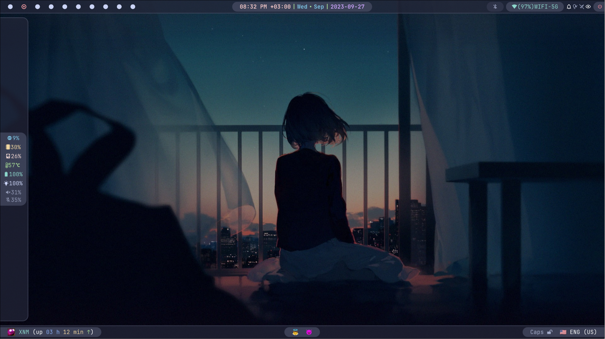
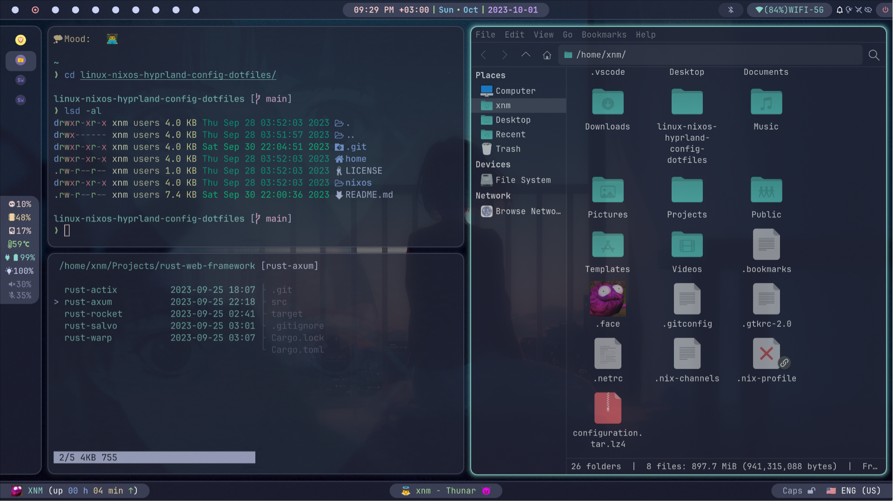
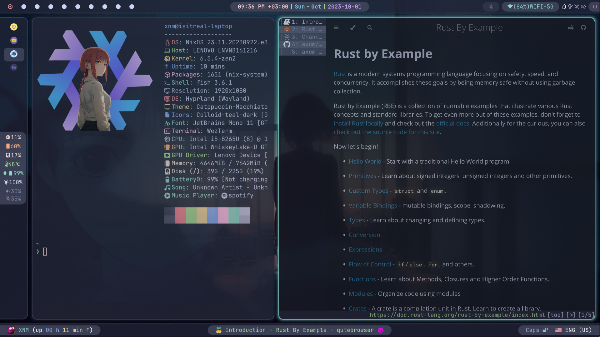

<h1 align="center">NixOS & Hyprland with Catppuccin Macchiato Theme Configuration</h1>

## Table of Contents
- [About](#-about)
- [Showcase](#-showcase)
- [Components](#-components)
- [Features](#-features)
- [Installation](#-installation)
- [Keybindings](#️-keybindings)
- [Useful info for Rustaceans](#-useful-info-for-rustaceans)
- [License](#-license)

## 📖 About

This repository houses my NixOS Linux configuration, featuring the Hyprland window manager and adorned with the stylish Catppuccin Macchiato theme. I rely on this setup as my daily driver for work and programming, primarily in Rust 🦀. Feel free to utilize it in its entirety or borrow specific components for your own configuration.

🚨It's essential to note that this configuration is not minimalistic or lightweight and may require some disk space and knowledge to understand. If you're looking for something simpler, this configuration may not be suitable for you.

This system leverages cutting-edge channels and versions of software to provide you with the latest updates and features. Notably, it utilizes:

- **nixpkgs**: unstable
- **hyprland**: development version
- **linux kernel**: mainline
- **rust**: nightly version

This approach ensures that you stay on the forefront of technology, receiving the most recent software advancements promptly. 🚨However, it's important to note that this emphasis on bleeding-edge software may impact the stability of the system. 

You have the flexibility to customize these configurations according to your needs by modifying the respective configuration files.

## 🌟 Showcase

The showcased images do not reflect the latest version of the system's appearance. The final setup may vary slightly.

[Showcase Video](home/Videos/Records/record.mp4)

## 🔧 Components

| Component             | Version/Name                |
|-----------------------|-----------------------------|
| Distro                | NixOS                       |
| Kernel                | Mainline                    |
| Shell                 | Fish                        |
| Display Server        | Wayland                     |
| WM (Compositor)       | Hyprland                    |
| Bar                   | Waybar                      |
| Notification          | Dunst                       |
| Launcher              | Rofi-Wayland                |
| Editor                | Helix                       |
| Terminal              | WezTerm + Starship          |
| OSD                   | Avizo                       |
| Night Gamma           | Gammastep                   |
| Fetch Utility         | Neofetch                    |
| Theme                 | Catppuccin Macchiato        |
| Icons                 | Colloid-teal-dark, Numix-Circle |
| Font                  | JetBrains Mono + Nerd Font Patch |
| Player                | Youtube Music + Spotify     |
| File Browser          | Thunar                      |
| Internet Browser      | Qutebrowser, Brave + Vimium + NightTab + Stylus |
| Mimetypes             | MPV, Imv, Zathura            |
| Image Editor          | Swappy                      |
| Screenshot            | Grim + Slurp                |
| Recorder              | Wf-recorder                 |
| Color Picker          | Hyprpicker                  |
| Clipboard             | Wl-clipboard + Cliphist + Clipboard-jh |
| Idle                  | Swayidle                    |
| Lock                  | Swaylock                    |
| Logout menu           | Wlogout                     |
| Wallpaper             | Wpaperd                     |
| Graphical Boot        | Plymouth + Catppuccin-plymouth |
| Display Manager       | Greetd + Tuigreet           |

And many other useful utilities. The full list can be found in the system configuration at `/nixos/configuration.nix` file.

## ✨ Features

- 🔄 **Reproducible**: Built on NixOS, this configuration can be effortlessly reproduced on other machines, ensuring a consistent setup.

- 🖌️ **Consistent**: Nearly every component has been meticulously styled to adhere to the Catppuccin Macchiato theme, providing a visually cohesive experience.

- ✅ **Complete**: This system is equipped with a wide range of components and utilities, akin to the completeness of operating systems like MacOS or Windows.

- 🎨 **Customizable**: Leveraging the power of Linux and Hyprland, this configuration offers extensive customization options, allowing you to tailor your setup to your preferences.

## 🚀 Installation

1. Download and Install NixOS from the [official site](https://nixos.org/download).
2. Temporarily install ripgrep and fish using the command: `nix-shell -p ripgrep fish --run fish`. You can also use classic bash and grep for the next step without installing fish and ripgrep.
3. Run the command `rg --hidden FIXME` and change/add lines to match your device, swaps, partitions, and file systems in the configuration files (`/etc/nixos/configuration.nix` & `/etc/nixos/hardware-configuration.nix`). 🚨Ensure that you configure USBGuard in the `configuration.nix` file to avoid potential issues. By default, USBGuard blocks all USB devices, which can lead to the disabling of crucial hardware components such as the integrated camera, bluetooth, wifi, etc. To configure USBGuard properly, add your trusted USB devices to the configuration. You can obtain a list of all connected devices by using the `lsusb` command from the usbutils package.
Failure to configure USBGuard appropriately may result in the inability to connect any USB devices to your machine. If needed, you can also disable USBGuard altogether by setting `services.usbguard.enable` to `false` in the configuration:`services.usbguard.enable = false;`.
This step ensures that USBGuard is not actively blocking any USB devices.
4. To change the default username and/or hostname, run the command `rg --hidden 'xnm'` to find and fix all instances of the username, and `rg --hidden 'isitreal-laptop'` for the hostname. Make sure to change the username to match yours to avoid login issues.
5. Copy all files (with replacements) from the `home` directory to your `$HOME` directory in Linux.
6. Copy all files (with replacements) from the `nixos` directory to `/etc/nixos/`. 🚨It's recommended not to copy and replace `hardware-configuration.nix`; use default generated one, or only copy my `hardware-configuration.nix` if you have already change it for your hardware.
7. Run the command `sudo nixos-rebuild switch`. After this, you will have a complete system. You can also use flakes after first setup by running `sudo nixos-rebuild switch --flake /etc/nixos` if needed.

## ⌨️ Keybindings

### Main

| Key Combination        | Action                       |
|------------------------|------------------------------|
| ALT + R                | Resize windows mode          |
| ALT + M                | Move windows mode            |
| SUPER + H, J, K, L     | Change window focus          |
| SUPER + 1..0           | Change workspace             |
| SUPER + SHIFT + 1..0   | Move window to workspace     |
| SUPER + SHIFT + Q      | Kill active window           |
| SUPER + SHIFT + F      | Toggle floating window       |
| SUPER + CTRL + F       | Toggle full-screen           |
| SUPER + SHIFT + O      | Toggle split                 |
| SUPER + SHIFT + P      | Toggle pseudo                |
| SUPER + SHIFT + M      | Exit from `hyprland`         |
| SUPER + CTRL + E       | Expose all windows using `pyprland` |
| SUPER + CTRL + M       | Expose all minimized windows using `pyprland` |
| SUPER + M              | Minimize or restore a window using `pyprland` |
| SUPER + CTRL + T       | Launch scratchpad with `wezterm` using `pyprland` |
| SUPER + CTRL + V       | Launch scratchpad with `pavucontrol` using `pyprland` |
| SUPER + T              | Launch `wezterm`             |
| SUPER + D              | Launch `rofi -drun`          |
| SUPER + B              | Launch `qutebrowser`         |
| SUPER + SHIFT + B      | Launch `brave`               |
| SUPER + F              | Launch `thunar`              |
| SUPER + ESCAPE         | Launch `wlogout`             |
| SUPER + S              | Launch `spotify`             |
| SUPER + Y              | Launch `youtube-music`       |
| SUPER + SHIFT + D      | Launch `discord`             |
| SUPER + SHIFT + T      | Launch `telegram`            |
| SUPER + SHIFT + L      | Launch `swaylock`            |
| SUPER + SHIFT + S      | Take screenshot              |
| SUPER + E              | Launch `swappy` to edit last taken screenshot |
| SUPER + R              | Record screen area (MP4)     |
| SUPER + SHIFT + R      | Record screen area (GIF)     |
| SUPER + C              | Launch color picker (using `hyperpicer`) |
| SUPER + Z              | Toggle Zoom (with `pyprland`)|
| SUPER + V              | Launch clipboard menu (`rofi -dmenu`) |
| SUPER + SHIFT + V      | Launch clipboard menu (`rofi -dmenu`) (copy to clipboard) |
| SUPER + X              | Launch clipboard deletion item menu (`rofi -dmenu`) |
| SUPER + SHIFT + X      | Clear clipboard             |
| SUPER + U              | Launch bookmark menu (`rofi -dmenu`) |
| SUPER + SHIFT + U      | Add text from clipboard to bookmark |
| SUPER + CTRL + U       | Launch bookmark deletion item menu (`rofi -dmenu`) |
| SUPER + SHIFT + A      | Toggle airplane mode        |
| SUPER + SHIFT + N      | Toggle notifications        |
| SUPER + SHIFT + Y      | Toggle bluetooth            |
| SUPER + SHIFT + W      | Toggle wifi                 |
| SUPER + P              | Toggle play-pause player    |
| SUPER + ]              | Player next track           |
| SUPER + [              | Player previous track       |

You can find all other keybindings in `/home/.config/hypr/hyprland.conf` in the bind section. All system fish scripts are located at `/home/.config/fish/functions` directory.

## 🦀 Useful info for Rustaceans

Here are some tips to enhance your Rust experience on this system:

1. **Installation Customization:**
   This system utilizes [rust-overlay](https://github.com/oxalica/rust-overlay) for Rust installation using the Nix approach. To customize the installation, including modifications to compilation targets, components, channels, or profiles, follow these steps:

   - Locate the `/nixos/rust-toolchain.toml` file and make the necessary adjustments based on your requirements.

   - If you are working on multiple projects with distinct `rust-toolchain.toml` files or need to switch between stable and nightly Rust versions, consider the following options:
   
     - Set up a Nix environment using `flake.nix` and [rust-overlay](https://github.com/oxalica/rust-overlay) for each project separately. Utilize `nix develop` or `direnv` to manage project-specific Rust environments.

     - Alternatively, you can install `rustup` through `configuration.nix` and nixpkgs for a system-wide Rust setup. This allows you to manage Rust versions globally through `rustup`.

2. **Troubleshooting Compilation Issues:**
   If you encounter issues during Rust compilation, particularly those related to OpenSSL, SQLite, Wayland, or any other program utilized by `pkg-config` in the compilation process (see [here](https://nixos.wiki/wiki/Rust#Building_Rust_crates_that_require_external_system_libraries)), you can employ the `nix-shell -p pkg-config {your_dependency} [other_dependencies] --run fish` command. This command opens a Nix shell with the necessary dependencies, facilitating seamless code compilation.
   Moreover, when using the Nix shell, be aware that the compilation takes place in the runtime directory, which might be insufficient for certain projects. To address this, you can adjust the runtime directory size in the `configuration.nix` file under `services.logind.extraConfig="RuntimeDirectorySize=8G"`.

3. **Cross-Compilation:**
   For cross-compilation, consider using tools like `zigbuild` or `cross`. Personally, I find `zigbuild` preferable, but both are valuable options for your cross-compilation needs.

4. **Cargo and Rust Tools:**
   This system comes equipped with a variety of cargo and rust tools to ensure a smooth Rust development experience. Some of these tools include:
   - `rust-analyzer`
   - `cargo-deny`
   - `cargo-audit`
   - `cargo-update`
   - `cargo-edit`
   - `cargo-outdated`
   - `cargo-license`
   - `cargo-tarpaulin`
   - `cargo-cross`
   - `cargo-zigbuild`
   - `cargo-nextest`
   - `cargo-spellcheck`
   - `cargo-modules`
   - `cargo-bloat`
   - `bacon`

5. **Environment Setup:**
   You can set up your Rust project environment on this system using `nix develop` or `nix-shell` with `default.nix`, `shell.nix`, or `flake.nix` to create a tailored environment for your Rust project (Also, I personally recommend using it alongside with [direnv](https://direnv.net/)).

## 📜 License

This project is licensed under the MIT License - see the [LICENSE](LICENSE) file for details.
